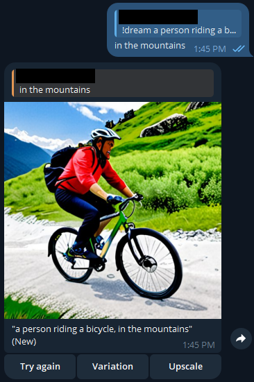

**Stable Diffusion Telegram Bot**  
  
A Docker container that allows you to host your own Telegram bot and generate images using the Stable Diffusion API. Can also be run as just a script without Docker.
  
**Features**  
  
* Host your own Telegram bot and add it to group chats or DMs with friends.  
* Use the `!dream` command to generate images from prompts.  
* Use the `!dream` command in an image caption to use both the prompt and image to generate an image.  
* Reply to `!dream` messages or captions to modify the prompt and generate new variations.  
* Regenerate images using the original prompt, modified prompts, or existing generated images.  
* Upscale generated images to 1024x1024 or 2048x2048 resolution using tile resampling via ControlNet.  
  
**Examples**  
Generating image from text | Generating image from image | Prompt Modification| 
:-------------------------:|:-------------------------:|:-------------------------:|
   |   |  
| - | - | - |
**Retrying** | **Generating Variation** |  **Upscaling**
   |   |  

**Environment Variables**  
  
The bot uses several environment variables that can be set when running the Docker container. These variables include:  
  
* `SERVER_URL`: The URL of the Stable Diffusion API server (default: http://127.0.0.1:7860/).  
* `TG_TOKEN`: The Telegram API token for your bot (default: None).  
* `MODEL`: The name of the Stable diffusion 1.5 or XL model to use (default: None).  
* `SAMPLER`: The sampler name to use for image generation (default: DPM++ 2M).  
* `CFG_SCALE`: An integer between 6 and 14 that controls the CFG scale (default: 7).  
* `DENOISING_STRENGTH`: A float between 0 and 1 that controls the denoising strength (default: 0.75).  
* `STEPS`: An integer between 1 and 150 (default: 25).
* `CLIP_LAYERS`: An integer between 1 and 12 (default: 2).
* `SEED`: A random Integer with value > 0. Value of -1 will generate a ranom number (default: -1).
* `WIDTH`: Width of the generated image (default: 512).
* `HEIGHT`: Height of the generated image (default: 512).
* `RESTORE_FACES`: Enable or Disable face restoring (default: True)
* `NEGATIVE_PROMPT`: The default negative prompt for all generations (default: '').  
* `RESIZE_MODE`: An integer between 0 and 3 for array: [just resize, crop and resize, resize and fill, just resize (latent upscale)] that controls how images are resized (default: 0).  
* `LORAS`: A string that provides default additions to prompts such as for LORAs (default: '').  
* `CONTROLNET_ENABLE`: A boolean that enables or disables using ControlNet for img2img generation (default: False).  
* `CONTROLNET_MODULE`: The name of the ControlNet module to use for img2img generation (default: 'none').  
* `CONTROLNET_MODE`: An integer between 0 and 2 for array: [Balanced, My prompt is more important, ControlNet is more important] that controls how ControlNet is used for img2img generation (default: 0).  
* `RECURSIVE_UPSCALE`: A boolean that enables or disables recursive upscaling (default: False).  
* `CONTROLNET_UPSCALE_MODEL`: Controlnet model to use for tile resample upscale (default: 'none').
  
**Getting Started**

***Telegram BotFather***
To use this bot, you will need to create a Telegram Bot and obtain a bot API token. To do so, message `/newbot` to [@BotFather](https://t.me/botfather) on telegram. `BotFather` will reply with a series of steps for you to follow including choosing the name of your bot as well as it's username. Once the steps have been completed, `BotFather` will share your bot API token with you.  The token will be a string like
```
4839574812:AAFD39kkdpWt3ywyRZergyOLMaJhac60qc
```


***Stable Diffusion***
This bot relies on access to a local Stable Diffusion instance. Please follow the README for [Automatic1111](https://github.com/AUTOMATIC1111/stable-diffusion-webui) for complete Windows installation steps.

For NVIDIA GPUs:
  
1. Install [Python 3.10.6](https://www.python.org/downloads/release/python-3106/), ensuring "Add to PATH" is checked 
2. Install [git](https://git-scm.com/download/win)
3. Clone `https://github.com/AUTOMATIC1111/stable-diffusion-webui.git` with `git clone` and navigate to the directory.  
4. Run `webui.bat --api --listen`

For AMD GPUs:

 I highly suggest following along with the video by [FE-Engineer](https://www.youtube.com/watch?v=n8RhNoAenvM) which outlines the below instructions on how to install ROCm on Windows and how to use ZLUDA. Full credit on the AMD GPU instructions to the author of that video.
>ZLUDA only works on [HIP SDK supported](https://rocm.docs.amd.com/projects/install-on-windows/en/develop/reference/system-requirements.html) AMD GPUs

1. Install [Python 3.10.6](https://www.python.org/downloads/release/python-3106/), ensuring "Add to PATH" is checked 
2. Install [git](https://git-scm.com/download/win)
3. Install [HIP SDK for Windows](https://www.amd.com/en/developer/resources/rocm-hub/hip-sdk.html) 
>Ensure you de-select the Visual Studio Code options during install or you will get an error during install
4. Download the latest [ZLUDA .zip release](https://github.com/lshqqytiger/ZLUDA/releases/) and extract it to your chosen directory
5. Add `%HIP_PATH%bin` and add the extracted folder location for ZLUDA to PATH 
6. Clone `https://github.com/lshqqytiger/stable-diffusion-webui-directml.git` with `git clone` and navigate to the directory.  
7. Run `webui.bat`
8. After install, stop `webui.bat`
9. Copy `cublas.dll` and `cusparse.dll` from the extracted ZLUDA folder to `...\stable-diffusion-webui-directml\venv\Lib\site-packages\torch\lib`
10. Delete the existing `cublas64_11.dll` and `cusparse64_11.dll` from `...\stable-diffusion-webui-directml\venv\Lib\site-packages\torch\lib`
11. Rename the copied `cublas.dll` and `cusparse.dll` files to `cublas64_11.dll` and `cusparse64_11.dll` respectively
12. Run `webui.bat --use-zluda --api --listen`
> Note, first image generation will take a very long time and will look like it is doing nothing. The bot will likely time out. Leave your computer be for quite some time and keep an eye on the terminal window for progress.

***Option 1: Python***
To get started with Python, ensure you have [Python 3.10.6](https://www.python.org/downloads/release/python-3106/) installed and added to your PATH prior to following the steps below: 

1. Clone this repository with `git clone` and navigate to the directory.  
2. Run `python -m pip install -r requirements.txt` to install the required packages on your local machine.  
3. Copy `exmaple.env` to `.env` and replace the values.
4. Once installed, run `python bot.py`.  
5. The Telegram bot should now be running and accessible.

***Option 2: Docker***
>Use the below steps if you would like to make code changes and build the image locally. Otherwise, use the image available on [Docker Hub](https://hub.docker.com/r/vshadbolt/stable-diffusion-telegram-bot), `vshadbolt/stable-diffusion-telegram-bot:latest`, in the [compose](docker-compose.yml) file.

To get started with Docker, ensure you have [Docker Desktop](https://www.docker.com/products/docker-desktop/) installed or otherwise have Docker running on your machine prior to following the steps below: 

1. Clone this repository with `git clone` and navigate to the directory.  
2. Run `docker build -t stable-diffusion-telegram-bot .` to build the Docker image.  
3. (Optional) Modify the `docker-compose.yml` file environment variables.
4. Once built, run `docker compose up`.  
>The Telegram bot should now be running and accessible.

If using Docker [Portainer](https://www.portainer.io/), use the following steps instead:

1. Clone this repository and navigate to the directory.  
2. Run `docker build -t stable-diffusion-telegram-bot .` to build the Docker image.  
3. Once built, run `docker save -o stable-diffusion-telegram-bot.tar stable-diffusion-telegram-bot` to save the built docker image to a .tar file in the repository directory
4. Import the image to Portainer ([guide](https://docs.portainer.io/user/docker/images/import))
5. Create a new Stack by copying the [compose](docker-compose.yml) file from this repository
>Deploy the stack and the Telegram bot should be running and accessible. 

***Common Errors***

1. If the bot does not immediately start, ensure the Telegram Token `TG_TOKEN` is set in the .env or docker compose file. If left as `None` the bot will not be able to start and will show an error similar to below in the logs: 
`The token 'None' was rejected by the server.`

2. If the bot is unable to access the stable diffusion API server, it will hang on `Dreaming...` before eventually sending a message that `Stable diffusion is not currently running, come back later`. 

3. If the bot hangs after `Dreaming...`, `Dreaming again...`, `Generating dream variation...`, or `Upscaling dream...`, ensure that the bot is still not actively generating the image or otherwise check for error messages in the API response (can be found in the container logs). Attempting to use a model you do not have installed in Stable Diffusion, using ControlNet without the extension installed, or otherwise having a malformed Environment variable will often lead to API errors.
